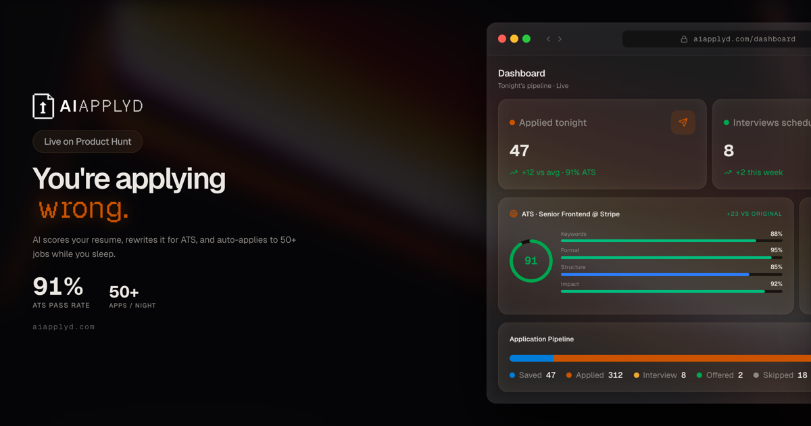

<div align="center">



# AI Applyd

**The AI that applies to jobs while you sleep.**

It rewrites your resume for every posting, fills out the screener questions, clicks Submit on Greenhouse, Lever, Ashby, SmartRecruiters, join.com via direct-API, plus Workday, LinkedIn Easy Apply, and the long tail via an AI browser agent. You wake up to interview emails instead of "we regret to inform you."

[](https://aiapplyd.com)
[](./LICENSE)
[](https://aiapplyd.com/pricing)
[](https://aiapplyd.com/proof)

[**Try it free**](https://aiapplyd.com) - [**Pricing**](https://aiapplyd.com/pricing) - [**Submission Wall**](https://aiapplyd.com/proof) - [**MCP server**](https://mcp.aiapplyd.com) - [**Blog**](https://aiapplyd.com/blog)

</div>

---

## Why this exists

I lost my job in February. Three months of runway, a working laptop, and 47 hand-written applications by Sunday afternoon. By the 30th cover letter I was a zombie typing "I am excited to apply for this opportunity at your great company" while a real human read none of it.

So I wrote a Chrome extension that filled in forms based on a JSON resume. The 20 jobs the bot applied to got 3 callbacks. The 47 I'd done by hand got 1. That ratio is what AI Applyd is now.

The applying-while-you-sleep part is the gimmick. The real product is a filter: you say yes to everything that fits, and only spend time on the conversations that come back.

\- Ava

---

## Demo


Live product: **[aiapplyd.com](https://aiapplyd.com)** - free signup, 20K tokens funds one full end-to-end auto-apply.

---

## What it does

- [x] **ATS resume scoring** - paste a job description or URL, get a 0-100 compatibility score with section-level feedback in 30 seconds
- [x] **AI resume tailoring** - generates a per-job resume that mirrors keywords without keyword-stuffing, exports to PDF + DOCX
- [x] **Auto-apply** - direct-API submitters for Greenhouse, Lever, Ashby, SmartRecruiters, join.com. AI browser agent fallback (with Stagehand fastpath selectors for Workday, iCIMS recognition, Ashby microsites, SmartRecruiters, Workable, Breezy) handles LinkedIn Easy Apply, Indeed, and the long tail.
- [x] **Cover letter generation** - tailored per job, references the company's actual posting, not boilerplate
- [x] **Interview prep** - company-specific questions pulled from real interview reports, plus generated answers grounded in your resume
- [x] **Application tracking** - saved through offered, in one dashboard with response-rate analytics
- [x] **Proof of submission** - proof screenshot on every browser-driven submission, structured submission receipt on direct-API platforms (Greenhouse, Lever, Ashby, SmartRecruiters, join.com). Public wall at [/proof](https://aiapplyd.com/proof)
- [x] **Public MCP server** - connect Claude Desktop, Claude Code, Cursor, or ChatGPT and use the tools directly in your AI client ([mcp.aiapplyd.com](https://mcp.aiapplyd.com))
- [x] **Token refunds on non-user-fault failures** - if a run dies because the page was unreadable, the ATS was down, or the captcha solver was out, tokens go back to your balance automatically
- [x] **Per-session cost guard** - per-platform spend caps (Workday/Greenhouse $1.50, Lever/Ashby $0.80, generic $1.00). Stuck sessions get killed before they bleed money
- [x] **Chrome extension** - one-click apply from any job page on any site

---

## How it works

```
1. Upload resume     -> AI parses experience, skills, dates into a profile
        |
        v
2. Score against     -> 0-100 ATS compat score, missing keywords called out
   job description
        |
        v
3. Tailor + generate -> Per-job resume + cover letter, you preview before send
        |
        v
4. Auto-apply        -> Direct-API submission on Greenhouse/Lever/Ashby/
   (direct-API or       SmartRecruiters/join.com (returns a structured
   AI browser agent)    receipt). Everything else routes through the AI
                        browser agent on Browserbase, which fills the
                        form and saves a proof screenshot of the
                        confirmation page.
        |
        v
5. Track + follow up -> Every application saved, status updates, recruiter
                        emails matched back to the application
```

A bad auto-apply tool will keep clicking buttons in a loop until it submits something broken. A good one knows when to stop. AI Applyd has a per-session cost guard, a stuck-loop fingerprint detector, an off-origin navigation guard, and a confirmation verifier that needs at least 2 of 3 success signals before it marks an apply as sent.

---

## Pricing

Monthly only. No annual lock-in.

| Plan | Price | AI applies | ATS scores | Resume tailors | Tokens |
|------|-------|------------|------------|----------------|--------|
| **Job Seeker** | Free | 1 (taste-test) | 10 / month | 5 / month | 20K signup |
| **Hired in 30** | $39 / mo | 100 / month, 15 / day | Unlimited | Unlimited | 7M / mo |
| **Hired Yesterday** | $79 / mo | 300 / month, 50 / day | Unlimited | Unlimited | 15M / mo |

Per-application math at full utilization: **$0.39** on Hired in 30, **$0.26** on Hired Yesterday.

[Full pricing](https://aiapplyd.com/pricing)

---

## Tech stack

Built solo, on Cloudflare's edge.

- **Frontend**: TanStack Start, TanStack Router, Tailwind, shadcn/ui, Zustand
- **Backend**: Hono on Cloudflare Workers
- **Database**: Cloudflare D1 (SQLite at the edge), Drizzle ORM
- **Auth**: Better Auth + Google OAuth
- **AI**: OpenRouter routed through Vercel AI SDK; Gemini 2.5 Flash Lite for high-volume work, Claude Haiku for tool-calling
- **Browser automation**: Browserbase + Stagehand for auto-apply, Cloudflare Browser Rendering for scraping
- **Email**: React Email + Resend
- **Payments**: Stripe
- **Analytics + replay + flags**: PostHog
- **MCP**: public Cloudflare Worker at mcp.aiapplyd.com

No SaaS bills above the Cloudflare base. The whole platform runs on the free tiers of every dependency I could keep on a free tier.

---

## How it compares

|  | AI Applyd | LazyApply | Simplify Copilot | Teal | JobCopilot |
|--|-----------|-----------|------------------|------|------------|
| **Price (monthly)** | $39 | ~$8-83 (annual prepay) | ~$80 | $29-49 | $39 |
| **ATS score before applying** | Yes | No | Basic | Yes | No |
| **Per-job resume tailoring** | Yes | No | Yes | Manual | Yes |
| **LinkedIn ban risk** | Low (applies on company site) | High (automates inside LinkedIn) | Medium | None (no auto-apply) | Medium |
| **Submission proof** | Screenshot on browser-driven, receipt on direct-API | No | No | N/A | No |

Numbers from head-to-head testing with 500+ tracked applications. Mass-apply tools (LazyApply, LockedIn AI) sat at 1.5% callback. Quality-gated AI Applyd reached 14%. Hand-written tailored applications reached 18%, took 5x longer.

---

## FAQ

**Will I get banned from LinkedIn?**
Unlikely. The tools that get accounts banned inject scripts into the LinkedIn page from a Chrome extension. AI Applyd does not do that. When a job lives on the company's own ATS we route through Greenhouse, Workday, Lever, etc. directly. LinkedIn Easy Apply runs through the AI browser agent on Browserbase with residential proxies and human pacing.

**Is there really a free tier?**
Yes. Free Job Seeker plan, no credit card. 20K tokens at signup is enough for one full auto-apply end-to-end so you can see what it actually does before paying.

**Does it apply to jobs without me knowing?**
Only if you flip Autopilot on. Default mode is manual approval, you preview each application before it sends. About 60% of users stay on manual for the first week then turn it off.

**Where do you store my resume?**
Cloudflare D1, encrypted in transit (TLS/HTTPS) and encrypted at rest via Cloudflare D1's default at-rest encryption. We do not sell your data. Your resumes, jobs, and application content are never used to train AI Applyd's own models. One-click delete from your dashboard wipes everything.

**Why monthly only, no annual?**
Because the worst version of this product would be one that gets you locked in for a year and then doesn't have to keep delivering. If we stop being useful you should be able to leave next month.

**Can I use it without giving you my LinkedIn password?**
Yes. We never ask for LinkedIn credentials. When you connect LinkedIn for Easy Apply support, OAuth handles auth and we never see your password.

**Do I need the Chrome extension?**
No. The web app does everything. The extension is a one-click apply button when you're already browsing job listings.

[**See all 30+ FAQs**](./FAQ.md)

---

## Links

- Live product: [aiapplyd.com](https://aiapplyd.com)
- Pricing: [aiapplyd.com/pricing](https://aiapplyd.com/pricing)
- Submission wall: [aiapplyd.com/proof](https://aiapplyd.com/proof)
- MCP server: [mcp.aiapplyd.com](https://mcp.aiapplyd.com)
- Blog: [aiapplyd.com/blog](https://aiapplyd.com/blog)
- Twitter / X: [@aiapplydHQ](https://x.com/aiapplydHQ)
- LinkedIn: [linkedin.com/company/aiapplyd](https://www.linkedin.com/company/aiapplyd/)
- Discord: [discord.gg/9PZ2V8DNM5](https://discord.gg/9PZ2V8DNM5)
- Founder: [@firstexhotic](https://x.com/firstexhotic)

---

<sub>Built solo by Ava Bagherzadeh on Cloudflare. 2026.</sub>
